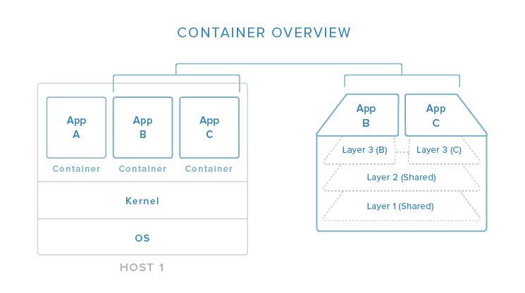
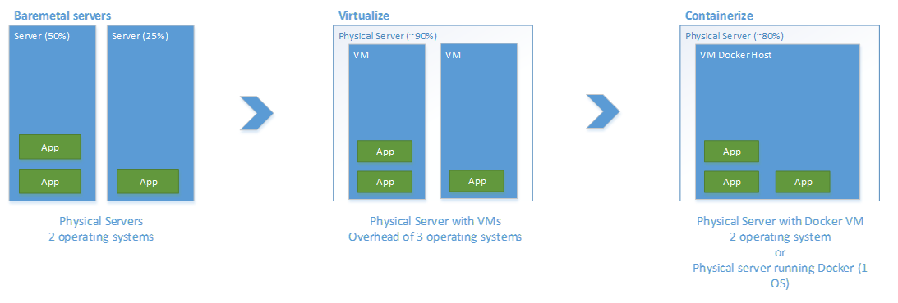

# Docker

*Docker is an open platform for building, shipping and running distributed applications. It gives programmers, development teams and operations engineers the common toolbox they need to take advantage of the distributed and networked nature of modern applications.*

Docker provides excellent isolation of software from the host operating with minimal overhead when compared to virtualization of an entire operating system with software installed.

*In this image, you can begin to see (in a simplified view) how containers relate to the host system. Containers isolate individual applications and use operating system resources that have been abstracted by Docker. In the exploded view on the right, we can see that containers can be built by "layering", with multiple containers sharing underlying layers, decreasing resource usage.*

*Docker’s main advantages are:*

- *Lightweight resource utilization: instead of virtualizing an entire operating system, containers isolate at the process level and use the host’s kernel.*
- *Portability: all of the dependencies for a containerized application are bundled inside of the container, allowing it to run on any Docker host.*
- *Predictability: The host does not care about what is running inside of the container and the container does not care about which host it is running on.  The interfaces are standardized and the interactions are predictable.*

Building on the software Artifacts published to Artifactory a companion Docker registry, in Artifactory, will host a selection of Docker images for use in applications. These Docker images will provide a reasonable level of configuration to ensure acceptable levels of reuse. It is understood that variations may be created for particular use cases. For example a KeyView Docker image might be used as a reference to create an image with a PaaS Async Worker or the inclusion of an Agentstore with a Policy Server image.

The Dockerfile(s) and associated resources will be published to serve as a reference and aid with customisation/creation of new Docker images.

We recommend Docker packaging of all software deployed to slaves within a Mesos cluster. This protects the slaves from changes made by the deployed software and ensures the state of the slaves remains consistent. Where containers require

The [Open Container Initiative](https://www.docker.com/docker-news-and-press/06.22.2015_Industry-Leaders-Unite-to-Create-Project-for-Open-Container-Standards) was announced recently and promises to unify competing container solutions.

Teams will manage internal Docker registries for continuous integration builds, publishing releases to Artifactory.

### Alternatives considered

#### Virtual Machines

The rise of Docker and other container solutions is in direct response to the overheads associated with the traditional approach of packaging services within a virtual machine.

Each instance of a virtual machine introduces overheads of a discrete operating system, requiring disk, CPU and RAM. Virtual machine instances are slow to start when compared to a container that can start in seconds.

In the above diagram three approaches are contrasted.

**Baremetal** servers with different applications deployed on each, applications can conflict with each other. Resource utilization is uneven across the machine.

**Virtualized** servers on a host share the resources of the host allowing for better resource utilization but introduce an overhead of multiple operating systems.

**Containerized** application run on a single host using the kernel from that host, the additional overheads of multiple operating systems are removed.
For this reason Docker containers are recommended.
